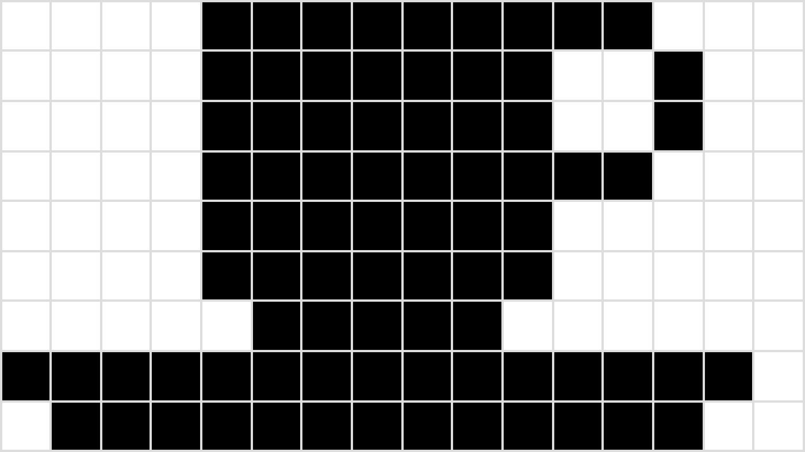
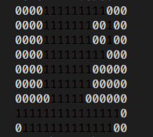

# Compressão de imagem sem perdas
As imagens estão ao nosso redor, de ícones de aplicativos a GIFs animados e fotos. Arquivos de imagem podem ocupar muito espaço, então os computadores empregam uma variedade de algoritmos para compactar arquivos de imagem.
Para as imagens mais simples, os computadores podem usar um algoritmo de compactação denominado codificação de comprimento de execução (RL

## Bitmaps
Antes de explorar a compactação de imagens, vamos ver como podemos representar uma imagem em binário sem nenhuma.

Aqui está uma imagem simples, um ícone de café. Vamos aumentar o zoom e sobrepor uma grade na parte superior, para que seja fácil ver exatamente quais pixels são vermelhos e quais são brancos

O ícone de `café` é composto de apenas duas cores, branco e preto, portanto, um computador poderia representá-lo em binário mapeando pixels preto para 111 e pixels branco para 000. Isso é chamado de bitmap , pois mapeia pixels em bits.

## Algoritmo de compressão RLE

Na codificação run-length, o computador substitui cada linha por números que indicam quantos pixels consecutivos são da mesma cor, sempre começando com o número de pixels brancos.

Por exemplo, a primeira linha contém 4 pixels brancos, 9 pixels pretos, 3 pixels brancos:  
`0000111111111000`  
Isso seria representado da seguinte forma:  
`[3,2,5,2,4]`

# Descompressão RLE
Quando um computador usa codificação de comprimento de execução, ele deve ser capaz de recriar perfeitamente a imagem da representação compactada - e nós também devemos, se seguirmos a estratégia do computador.
Vamos tentar. Aqui está uma representação de um ícone preto e branco usando RLE:

### Aqui está uma representação de um ícone preto e branco usando RLE:

4, 9, 3  
4, 7, 2, 1, 2    
4, 7, 2, 1, 2  
4, 9, 3  
4, 7, 5  
4, 7, 5  
5, 5, 6  
0, 15, 1  
1, 13, 2

A primeira linha tem 4 pixels brancos, depois 9 pixels pretos e depois 3 pixels brancos. Isso se parece com:

Executando o decodificador `RLE` pelo terminal, o ícone final é uma xícara e pires:

## [Khan academy compreenssão de dados](https://www.khanacademy.org/computing/computers-and-internet/xcae6f4a7ff015e7d:digital-information/xcae6f4a7ff015e7d:data-compression/a/simple-image-compression)
